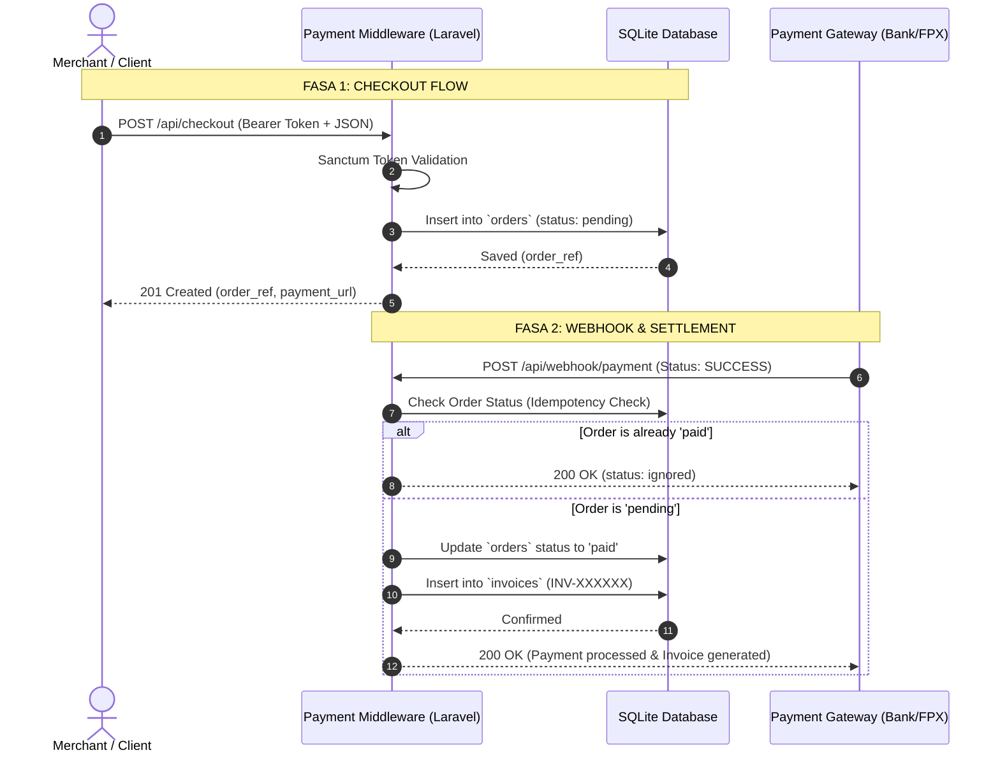
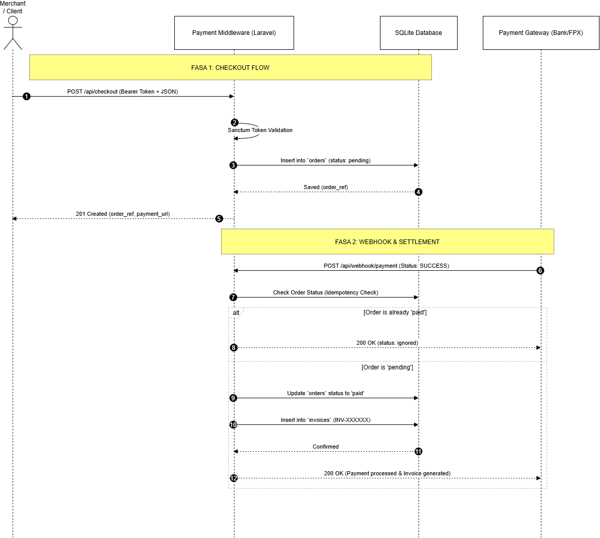

# 💳 Payment Middleware Service

A robust, headless RESTful payment middleware service built with **Laravel 11**, designed to bridge merchant applications with external payment gateways. It handles secure order creation, asynchronous webhook processing, idempotency control, and automated invoice generation.

---

## 📌 Problem Statement & Architecture

In enterprise e-commerce systems, directly coupling web applications with various payment gateways leads to messy codebases, security risks, and fragile callback handling. 

This **Payment Middleware** acts as a centralized intermediary hub:
* **Headless & Decoupled:** Merchant apps consume a clean REST API without worrying about gateway complexities.
* **Idempotent Webhooks:** Protects against network retries and duplicate callbacks to prevent double-charging or duplicate invoices.
* **Token-Based Security:** Endpoints are strictly guarded with Laravel Sanctum bearer tokens.

### System Flow Diagram



---

## 🛠️ Tech Stack & Key Concepts

* **Framework:** Laravel 11 (PHP 8.2+)
* **Database:** SQLite
* **Authentication:** Laravel Sanctum (Bearer Token)
* **Key Architecture Concepts:**
  * **Headless RESTful API Design**
  * **Eloquent Relational Mapping (`Order` hasOne `Invoice`)**
  * **Idempotency Guard** on Webhook endpoints
  * **Data Mapping** from external gateway payloads to internal schema

---

## 🔌 API Endpoints Specification

### 1. Create Checkout Order
* **Endpoint:** `POST /api/checkout`
* **Security:** `Bearer <Sanctum_Token>`
* **Headers:** `Accept: application/json`, `Content-Type: application/json`
* **Payload:**
  ```json
  {
    "customer_name": "Adeeb Fikri",
    "customer_email": "adeeb@example.com",
    "amount": 150.00
  }
  ```
* **Response (`201 Created`):**
  ```json
  {
    "message": "Order created successfully",
    "data": {
      "order_ref": "ORD-XXXXXXXX",
      "amount": "150.00",
      "status": "pending",
      "payment_url": "[http://127.0.0.1:8000/api/mock-pay/ORD-XXXXXXXX](http://127.0.0.1:8000/api/mock-pay/ORD-XXXXXXXX)"
    }
  }
  ```

---

### 2. Payment Webhook Callback
* **Endpoint:** `POST /api/webhook/payment`
* **Access:** Public (Protected via signature/idempotency verification)
* **Headers:** `Accept: application/json`, `Content-Type: application/json`
* **Payload:**
  ```json
  {
    "payment_ref": "ORD-XXXXXXXX",
    "gateway_status": "SUCCESS",
    "payment_channel": "fpx_maybank2u",
    "transaction_time": "2026-09-22 14:30:00"
  }
  ```
* **Response (`200 OK` - First Run):**
  ```json
  {
    "status": "success",
    "message": "Payment processed and invoice generated successfully.",
    "data": {
      "order_ref": "ORD-XXXXXXXX",
      "order_status": "paid",
      "invoice_number": "INV-2026-XXXXXX",
      "payment_method": "fpx_maybank2u",
      "paid_at": "2026-09-22 14:30:00"
    }
  }
  ```
* **Response (`200 OK` - Idempotent Repeated Request):**
  ```json
  {
    "status": "ignored",
    "message": "Order has already been processed."
  }
  ```

---

## 🚀 Local Installation & Setup

1. **Clone the repository:**
   ```bash
   git clone [https://github.com/](https://github.com/)<your-username>/payment-middleware.git
   cd payment-middleware
   ```

2. **Install dependencies:**
   ```bash
   composer install
   ```

3. **Configure Environment:**
   ```bash
   cp .env.example .env
   php artisan key:generate
   ```

4. **Run Database Migrations:**
   ```bash
   touch database/database.sqlite
   php artisan migrate
   ```

5. **Generate Merchant API Token (via Tinker):**
   ```bash
   php artisan tinker
   ```
   ```php
   $user = App\Models\User::create(['name' => 'Merchant Store', 'email' => 'merchant@store.com', 'password' => bcrypt('password')]);
   $token =$user->createToken('merchant-key')->plainTextToken;
   exit;
   ```

6. **Serve Application:**
   ```bash
   php artisan serve
   ```